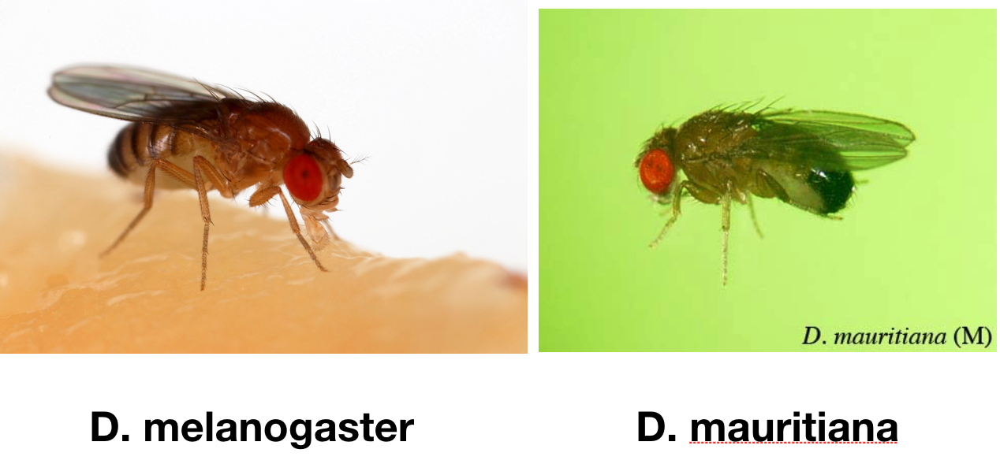

# QBB2020 - Day 2 - Lunch Exercise

Frequently when dealing with annotation data we will need to translate
identifiers according to a mapping. For example, mapping gene identifiers
to protein identifiers for searching a protein database, or identifying
orthologs using an existing orthology database (e.g. Homologene).

Here you will implement a python program to perform such a mapping. First you
will generate a mapping file in a simplified format, and then perform the
mapping.

## 1. Mapping FlyBase genes to UniProt

We want to build a mapping from FlyBase gene IDs to UniProt IDs.

Uniprot provides a mapping from FlyBase genes. You can download this mapping
using the command:

```
$ wget "http://www.uniprot.org/docs/fly.txt"
```

Opening `fly.txt` this looks difficult to parse. It has a free form header
and footer, and has rows with different numbers of fields and no clear
delimiter. One could certainly parse this file by determining field widths,
and tracking when the header ends, etc.

However, if you look at the data the fields we need are only on the lines
containing the string "DROME". This should make it much easier for you to
parse.

Parse this file, and output a new file with two tab separated columns, the
first containg the FlyBase ID and the second the Uniprot ID (AC). This is your parsed mapping file.

> Hint: running `split` without specifying a delimiter splits on "whitespace"
> by default. For example:
> ```
> s = "first second\tthird\t\t\tfourth"           |
> print "Split on space:",      s.split(" ")      | Split on space: ['first', 'second\tthird\t\t\tfourth']
> print "Split on tab:",        s.split("\t")     | Split on tab: ['first second', 'third', '', '', 'fourth']
> print "Split on whitespace:", s.split()         | Split on whitespace: ['first', 'second', 'third', 'fourth']
> ```

## 2. Identifier mapping

Write a **python script** for identifier mapping. (Alternatively, you may use a Jupyter Notebook, but only if you use a function.) <br /><br />
Your script should take as input two files and one argument that will affect functionality.
  1. the mapping file (as parsed from `fly.txt` in Part 1 above)
  2. a c_tab file from StringTie
      * You have a file `SRP004442.stringtie.tar.gz`. This is found in your `~/data/results/` directory.
      * You need to run `tar -xzf SRP004442.stringtie.tar.gz` to unpack this file. When you unpack/untar this file, it unpacks into the folder named `stringtie`
          * If this command throws an error, you should alternatively use `wget`, specifically: `wget https://bx.bio.jhu.edu/track-hubs/cmdb/t_data.ctab`
      * Then your c_tab file specifically is `~/data/results/stringtie/SRR072893/t_data.ctab`
  3. See below concerning this


Your script should find the corresponding translation from the mapping file. If found, it should print the
line from the c_tab file, replacing the `gene_id` field with the translated
identifier (**the UniProt ID**). If not found, it should do one of two things depending on the value of the third command
line argument (or a function argument if using Jupyter):

  1. Print nothing (ignore the line)
    * This should occur when a specific value is given for the third command line argument
  2. Print and fill the field with a default value specified on the
     command line.
    * This should occur if the value of the third command line argument is **NOT** the value chosen to ignore the line

  **NOTE:** We only want the first 100 lines of output displayed in the notebook or in an output file

## Submit
**DO NOT git add, commit, or push the two input files**

If you're using Python scripts, submit
  - your two Python scripts (parsing and identifier mapping), with any instructions needed to run them in a documentation comment
  - the first 100 lines of your identifier mapping output using each of the two options.

If you're using Jupyter notebook(s), submit
  - your notebook(s)
  - any output files, if you did write to them, containing the first 100 lines of your output


## FAQ

1. DROME? DROMA?


